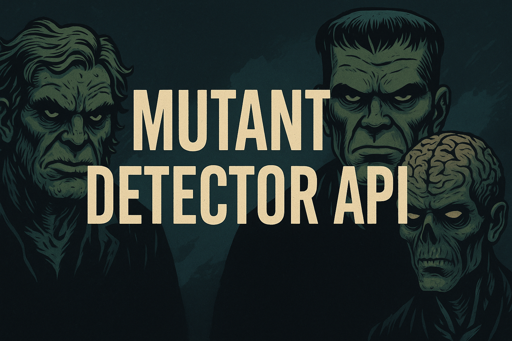
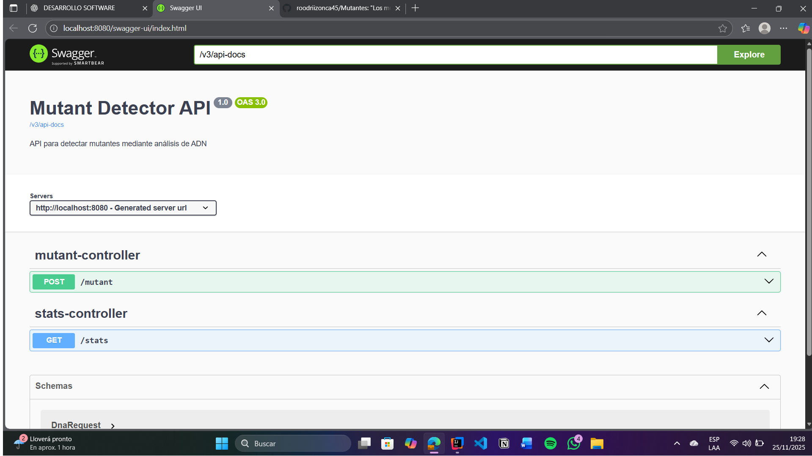
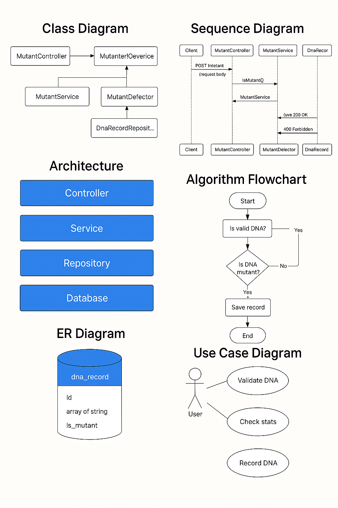

 


Proyecto desarrollado en **Java 23** + **Spring Boot 3** para detectar mutantes mediante el análisis de secuencias de ADN.  
Incluye arquitectura limpia, tests unitarios, Swagger, base de datos H2 y cobertura de código.

---

## Tecnologías principales

- Java 23  
- Spring Boot 3  
- Spring Web  
- Spring Data JPA  
- H2 Database  
- Lombok  
- Swagger / OpenAPI  
- JUnit 5 + Mockito  
- Jacoco  
- Gradle Kotlin DSL  

---
## Estructura Completa PROYECTO
\`\`\`
EntregaMutantes_51164/
├── README.md
├── build.gradle.kts
├── settings.gradle.kts
├── gradlew
├── gradlew.bat
├── .gitignore
│
├── src/
│ ├── main/
│ │ ├── java/
│ │ │ └── org/example/
│ │ │ ├── Application.java
│ │ │ │
│ │ │ ├── config/
│ │ │ │ └── SwaggerConfig.java
│ │ │ │
│ │ │ ├── controller/
│ │ │ │ ├── MutantController.java
│ │ │ │ └── StatsController.java
│ │ │ │
│ │ │ ├── dto/
│ │ │ │ ├── DnaRequest.java
│ │ │ │ └── StatsResponse.java
│ │ │ │
│ │ │ ├── entity/
│ │ │ │ └── DnaRecord.java
│ │ │ │
│ │ │ ├── exception/
│ │ │ │ ├── DnaHashCalculationException.java
│ │ │ │ └── GlobalExceptionHandler.java
│ │ │ │
│ │ │ ├── repository/
│ │ │ │ └── DnaRecordRepository.java
│ │ │ │
│ │ │ └── service/
│ │ │ ├── MutantDetector.java
│ │ │ ├── MutantService.java
│ │ │ └── StatsService.java
│ │ │
│ │ └── resources/
│ │ ├── application.properties
│ │ └── static/img/
│ │ ├── banner.png
│ │ ├── diagramas.png
│ │ └── swagger-ui.png
│
└── test/
└── java/org/example/
├── controller/
│ ├── MutantControllerTest.java
│ └── StatsControllerTest.java
│
└── service/
├── MutantDetectorTest.java
├── MutantServiceTest.java
└── StatsServiceTest.java
\`\`\`
---
## Documentación con Swagger

Acceso local: 
http://localhost:8080/swagger-ui/index.html


Vista previa:



---

## Endpoints principales

### **POST /mutant**  
Determina si una secuencia de ADN pertenece a un mutante.

### **GET /stats**  
Devuelve estadísticas globales del sistema.

---

## Base de Datos H2

Acceso:
http://localhost:8080/h2-console


## Configuración:

```properties
spring.datasource.url=jdbc:h2:mem:mutantsdb
spring.datasource.driverClassName=org.h2.Driver
spring.datasource.username=sa
spring.datasource.password=

spring.jpa.hibernate.ddl-auto=create-drop
spring.h2.console.enabled=true
spring.h2.console.path=/h2-console
```
---
## Tests Unitarios

Tests incluidos:

-MutantControllerTest
-StatsControllerTest
-MutantServiceTest
-StatsServiceTest
-MutantDetectorTest

Ejecutar:
./gradlew test

---
## Diagramas UML del Sistema

Incluye:
-Diagrama de Arquitectura
-Diagrama de Clases
-Diagrama de Casos de Uso
-Diagrama de Secuencia
-Diagrama de Componentes

Vista general:


---

## Autor

-Rodrigo Ángel Zonca
-Legajo: 51164
-Ingeniería en Sistemas de Información — UTN
-Desarrollador Full Stack-Master Swimming


